# Ledger Core


**[🇧🇷 Leia em Português](README_pt-br.md)**

High-integrity financial transaction engine implementing Double-Entry Ledger patterns, ACID compliance, and Pessimistic Locking to prevent double-spending race conditions.

---

## 🔒 Execution Flow (ACID & Locking)

```mermaid
sequenceDiagram
    participant Client
    participant API
    participant DB as Database (Postgres)

    Client->>API: POST /transfer (User A -> User B)
    
    rect rgb(20, 20, 20)
        note right of API: Start Database Transaction
        API->>DB: BEGIN
        
        note right of API: 1. Prevent Deadlock (Sort IDs)
        
        note right of API: 2. Acquire Locks (SELECT FOR UPDATE)
        API->>DB: SELECT * FROM users WHERE id IN (A, B) FOR UPDATE
        DB-->>API: Locked User Data
        note right of DB: 🔒 Rows A & B are now LOCKED
        
        API->>API: 3. Verify Balance (Invariant Check)
        
        API->>DB: UPDATE users SET balance = balance - amount WHERE id = A
        API->>DB: UPDATE users SET balance = balance + amount WHERE id = B
        API->>DB: INSERT INTO transactions ...
        
        API->>DB: COMMIT
        note right of  DB: 🔓 Locks Released
    end
    
    DB-->>API: Transaction Committed
    API-->>Client: 200 OK (Transfer Complete)
```



---

## 🏗 Why this exists?

Most "Wallet APIs" fail when subjected to:
1.  **Concurrent Requests:** 10 parallel requests spending the same balance.
2.  **Partial Failures:** Money leaves Account A but fails to arrive at Account B.
3.  **Deadlocks:** Circular dependencies when two users transfer to each other simultaneously.

This project solves these problems using **Database-Level Constraints** and **Explicit Locking Strategies**.

---

## 🚀 Key Features

### 1. Zero Race Conditions (Double Spending prevention)
Uses `SELECT ... FOR UPDATE` (Pessimistic Locking) to lock the payer and payee rows during the transaction. 
- *Result:* Parallel requests are queued by the database. The balance is guaranteed to be consistent.

### 2. ACID Transactions
All transfers run within a single Database Transaction.
- If the credit fails, the debit is rolled back.
- Money is never created or destroyed, only moved.

### 3. Deadlock Prevention
Locks are acquired in a deterministic order (by ID), preventing circular waits.
- `Lock(A) -> Lock(B)` is safe.
- `Lock(A) -> Lock(B)` AND `Lock(B) -> Lock(A)` (simultaneously) causes deadlocks. We force ID-based ordering to solve this.

---

## 🛠 Tech Stack

- **Runtime:** Node.js 20+ / TypeScript
- **Framework:** Fastify (Low overhead)
- **Database:** PostgreSQL 15
- **ORM/Query:**
  - **Hybrid Approach:** Used **Prisma** for robust schema management and **Kysely** for high-performance raw queries involving complex locking clauses not fully supported by high-level ORMs.
- **Testing:** Jest (Integration & Concurrency Tests)

---

## ⚡ Quick Start

### 1. Start Database
```bash
docker-compose up -d
```

### 2. Configure Environment
Create the `.env` file with database connection strings.
```bash
cp .env.example .env
```

### 3. Install Dependencies
```bash
npm install
```

### 4. Run Migrations
```bash
npm run db:migrate
```

### 5. Run Tests (The "Proof")
This will run concurrency stress tests (Race Condition & Deadlock scenarios).
```bash
npm test
```

---

## 👨‍💻 Author
**Gérson Resplandes**
Backend Engineer focused on Data Integrity & System Design.

[](https://www.linkedin.com/in/gerson-resplandes-de-s%C3%A1-sousa-999bb33a3/)
[](mailto:maiorgerson@gmail.com)
