# Ledger Core

**[🇺🇸 Read in English](README.md)**

Motor de transações financeiras de alta integridade implementando padrões de Contabilidade de Dupla Entrada (Double-Entry Ledger), conformidade ACID e Bloqueio Pessimista (`Pessimistic Locking`) para prevenir condições de corrida (Race Conditions) e gasto duplo.

---

## 🔒 Fluxo de Execução (ACID & Locking)

```mermaid
sequenceDiagram
    participant Cliente
    participant API
    participant DB as Banco de Dados (Postgres)

    Cliente->>API: POST /transfer (User A -> User B)
    
    rect rgb(20, 20, 20)
        note right of API: Início da Transação
        API->>DB: BEGIN
        
        note right of API: 1. Prevenir Deadlock (Ordenar IDs)
        
        note right of API: 2. Adquirir Locks (SELECT FOR UPDATE)
        API->>DB: SELECT * FROM users WHERE id IN (A, B) FOR UPDATE
        DB-->>API: Dados dos Usuários Travados
        note right of DB: 🔒 Linhas A & B estão BLOQUEADAS
        
        API->>API: 3. Verificar Saldo (Checagem de Invariante)
        
        API->>DB: UPDATE users SET balance = balance - amount WHERE id = A
        API->>DB: UPDATE users SET balance = balance + amount WHERE id = B
        API->>DB: INSERT INTO transactions ...
        
        API->>DB: COMMIT
        note right of  DB: 🔓 Locks Liberados
    end
    
    DB-->>API: Transação Comitada
    API-->>Cliente: 200 OK (Transferência Completa)
```



---

## 🏗 Por que isso existe?

A maioria das "APIs de Carteira" falha quando submetida a:
1.  **Requisições Concorrentes:** 10 requisições paralelas gastando o mesmo saldo.
2.  **Falhas Parciais:** O dinheiro sai da Conta A mas falha ao chegar na Conta B.
3.  **Deadlocks:** Dependências circulares quando dois usuários transferem um para o outro simultaneamente.

Este projeto resolve esses problemas utilizando **Restrições em Nível de Banco de Dados** e **Estratégias Explícitas de Bloqueio (Locking)**.

---

## 🚀 Funcionalidades Chave

### 1. Zero Race Conditions (Prevenção de Gasto Duplo)
Utiliza `SELECT ... FOR UPDATE` (Lock Pessimista) para travar as linhas do pagador e recebedor durante a transação no Postgres.
- *Resultado:* Requisições paralelas são enfileiradas pelo banco de dados. O saldo é garantido como consistente.

### 2. Transações ACID
Todas as transferências rodam dentro de uma única Transação de Banco de Dados.
- Se o crédito falhar, o débito é revertido (Rollback).
- Dinheiro nunca é criado ou destruído, apenas movido.

### 3. Prevenção de Deadlock
Os locks são adquiridos em uma ordem determinística (por ID), prevenindo esperas circulares.
- `Lock(A) -> Lock(B)` é seguro.
- `Lock(A) -> Lock(B)` E `Lock(B) -> Lock(A)` (simultaneamente) causa deadlocks. Nós forçamos a ordenação baseada no ID para resolver isso matematicamente.

---

## 🛠 Tech Stack

- **Runtime:** Node.js 20+ / TypeScript
- **Framework:** Fastify (Baixo overhead)
- **Banco de Dados:** PostgreSQL 15
- **ORM/Query:**
  - **Prisma:** Definição de Schema & Migrations (Fonte da Verdade)
  - **Kysely:** Construtor SQL Type-safe (Queries de Alta Performance)
- **Testes:** Jest (Testes de Integração & Concorrência)

---

## ⚡ Guia Rápido

### 1. Iniciar Banco de Dados
```bash
docker-compose up -d
```

### 2. Configurar Ambiente
Crie o arquivo `.env` com as strings de conexão do banco.
```bash
cp .env.example .env
```

### 3. Instalar Dependências
```bash
npm install
```

### 4. Rodar Migrations
```bash
npm run db:migrate
```

### 4. Rodar Testes (A "Prova Real")
Isso executará testes de estresse de concorrência (Cenários de Race Condition & Deadlock).
```bash
npm test
```

---

## 👨‍💻 Autor
**Gérson Resplandes**
Engenheiro Backend focado em Integridade de Dados & System Design.
